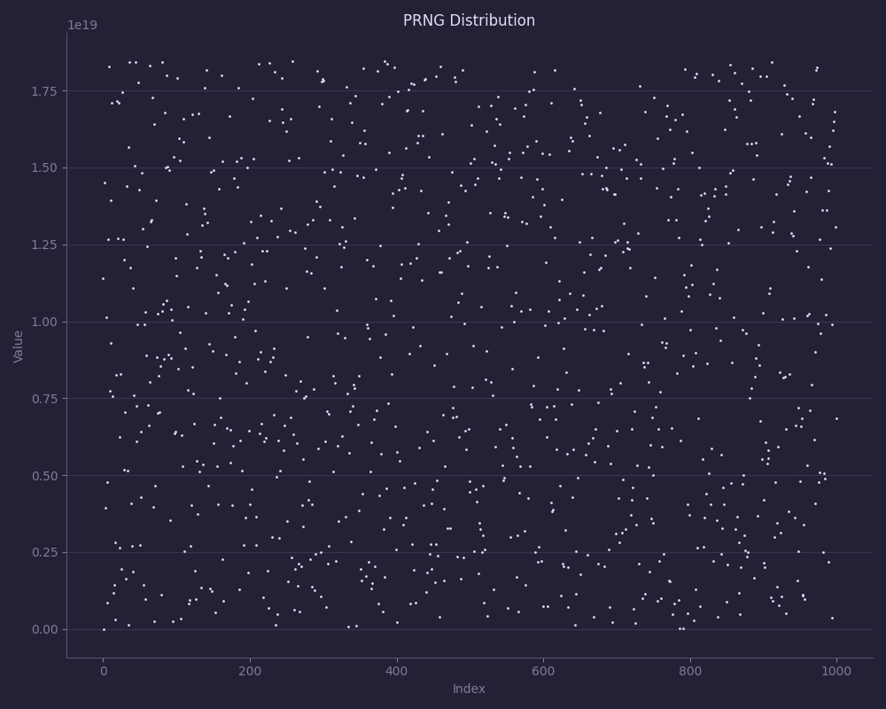

# Sphūr

[](https://github.com/frozen-lab/sphur/actions/workflows/unit_test.yaml)
[](https://github.com/frozen-lab/sphur/commits/main)
[](https://github.com/frozen-lab/sphur/pulls)
[](https://github.com/frozen-lab/sphur/issues)
[](https://github.com/frozen-lab/sphur/blob/master/LICENSE)

Sphūr (स्फुर्) is SIMD accelerated Pseudo-Random Number Generator.
It's fast, header-only, and designed for 64-bit numbers.

## Platforms

| Platform         |  Support  |
|------------------|:---------:|
| Windows x86_64   |    ✅     |
| Windows ARM64    |    ✅     |
| Linux x86_64     |    ✅     |
| Linux ARM64      |    ✅     |
| macOS x86_64     |    ✅     |
| macOS ARM64      |    ✅     |

## Benchmarks

| Metric                   | Value     |
| ------------------------ |:---------:|
| Throughput (numbers/µs)  | 228.57    |
| Chi-squared (uniformity) | 264.78    |
| Autocorrelation (lag 1)  | 0.01811   |

**📝 Notes:**

- Sphūr generates 228.57 numbers/µs, which is good enough for normal usage. You can generate about
  **228.57 million numbers per second** using AVX2!
- The _Chi-Squared_ represents uniformity. It represents how evenly distributed the generated numbers
  are across 256 bins. The prefect uniform distribution is `NUM_BINS - 1 = 255`. Sphūr's `264.78` is
  very close to the expected value and well within normal statistical variation.
- _Autocorrelation_ represents the correlation between consecutive random numbers. Ideally, consecutive
  numbers should be independent, giving a value close to `0`. Sphūr's `0.01811` is very low, indicating
  almost no correlation between successive numbers.



## Installation

Simply download the header file,

```sh
curl -O https://raw.githubusercontent.com/frozen-lab/sphur/refs/heads/master/clib/include/sphur.h
```

## Exmaple

```c
#include "sphur.h"
#include <stdint.h>
#include <stdio.h>

int main(void) {
 sphur_t sphur;

 if (sphur_init(&sphur) != 0) {
   printf("Failed to init sphur\n");
   return 1;
 }

 uint64_t dice = sphur_gen_rand_range(&sphur, 1, 6);
 printf("Rolled a dice: %lu\n", dice);

 return 0;
}
```

and now simply include the `sphur.h` header file into your compilation,

```sh
gcc -Wall -Wextra -O2 main.c sphur.h -o main
```

## Usage

### Default Initilization

```c
sphur_t rng;

if (sphur_init(&rng) != 0) {
    printf("Failed to initialize Sphūr\n");
    return 1;
}
```

### Initilization w/ Custom Seed

```c
sphur_t rng;
uint64_t seed = 123456789ULL;

if (sphur_init_seeded(&rng, seed) != 0) {
    printf("Failed to initialize Sphūr\n");
    return 1;
}
```

### Generate 64-bit random numer

```c
uint64_t r = sphur_gen_rand(&rng);
printf("Random number: %lu\n", r);
```
### Generate random numer w/ range

```c
uint64_t dice = sphur_gen_rand_range(&rng, 1, 6);
printf("Rolled a dice: %llu\n", dice);
```

### Generate random boolean

```c
int coin = sphur_gen_bool(&rng);
printf("Coin flip: %s\n", coin ? "Heads" : "Tails");
```
